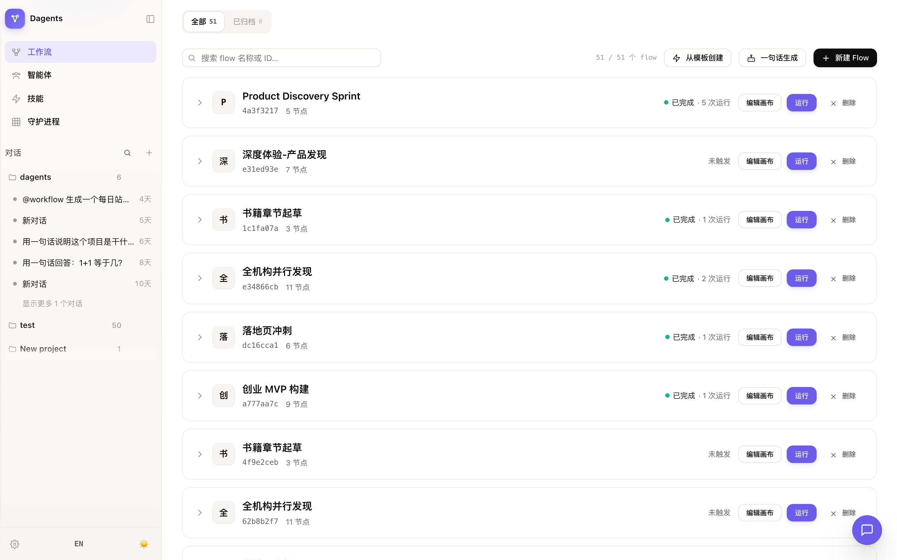
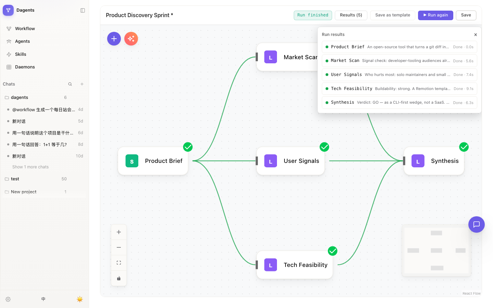

<div align="center">

# Dagents 平台

**把本地 CLI coding agent 编排成并行团队 —— 跑在你自己的机器上，对接你自己的 LLM Provider。**

[](./LICENSE)


Dagents 协调 `claude`、`codex`、`qwen` 等 17 种 CLI agent：可视化 DAG 画布编排并行工作流、逐节点流式旁观执行过程、聊天副驾一句话编译多 Agent 流程。**起步不需要 API Key —— 本地 CLI 就是执行引擎，数据不离开你的机器。**

[English](./README.md) · [简体中文](./README.zh-CN.md)


*一个 5 节点产品发现流程：三路分析并行扇出、逐节点流式输出（运行面板 live tail），汇成一份结论。演示录制用了脚本化 provider 控制节奏 —— 引擎、画布与流式均为真实应用。*



</div>

---

## 为什么是 Dagents

多数 agent 平台想自己做后端，Dagents 相反：**本地 CLI agent 就是基线执行引擎**，其他一切都是可选加速。

- **CLI 第一性** —— 聊天与工作流默认 spawn 本地 CLI agent（claude / codex / qwen 为保真维护的核心适配器，另有 14 个社区适配器）；HTTP LLM Provider 是可选快路径而非依赖。没配 provider？照样跑。
- **Workflow-First 工作台** —— 首页 `/` 就是 Flows 工作台：流程卡片 + 运行历史 + 一键带输入运行；画布在 `/workflows/[id]/canvas` —— 14 节点 DAG 引擎：并行波次、条件路由、循环、人机协同（React Flow）。
- **执行过程看得见** —— 节点徽章实时刷新（旋转 → 绿勾/红叉）、连线随进度点亮、运行面板逐节点流式输出正文；每次运行都有旁观直链（`canvas?run=<id>`），随时回看。
- **全局聊天副驾** —— 每个页面常驻悬浮副驾；`@workflow …` 一句话编译流程，`@agent` 按名字带着人格与技能派活。
- **Agent 人格库** —— 文件系统挂载任意 [agency-agents](https://github.com/msitarzewski/agency-agents) 类人格库（270+ 专家人格），按需启用、drift 三态同步上游；库里只装「已启用」的，天然不爆。
- **流程模板中心** —— 内置模板 / 团队场景模板 / 画布「另存为模板」三层收拢；实例化按 personaName 重绑人格，缺的自动降级 LLM 节点，模板永远可跑。
- **本地优先、隐私为王** —— Postgres 在本机，无遥测、无账号、不回传。LLM API Key 落库加密（AES-256-GCM）。
- **中英双语界面** —— 侧栏一键切换。



## 为什么不是 X

- **对比云端编排平台（Dify / n8n / LangFlow / Flowise）** —— 起步不需要 API Key，流程/模板/人格库都在本机，执行引擎就是你自己的本地 CLI。
- **对比单一 CLI 的原生多 Agent 模式** —— 在一处编排异构 CLI，提供 CLI 原生给不了的原语（并行波次、条件路由、人机协同），工作流是可沉淀、可分享的资产而非会话状态。
- **对比单 CLI 的 GUI 壳** —— 不锁任何厂商；画布与模板库是可沉淀、可版本化的资产，聊天副驾全局常驻。

## 架构

```
console (Next.js :3000) → gateway (Hono :8080) → @dagents/workflow 引擎
                                              → [dispatch 路由已并入 gateway] → 本地 daemon → CLI agent
```

| 组成 | 位置 | 说明 |
|---|---|---|
| Console | `apps/console` | Next.js App Router，所有后端调用经 gateway |
| Gateway | `apps/gateway` | Hono：SSO/认证、工作流 CRUD 与执行、dispatch 协议、LLM Provider CRUD + 动态代理 |
| 工作流引擎 | `packages/workflow` | 14 节点、DAG 执行器、SSE 流式、变量解析 |
| CLI 适配器 | `packages/agent-adapters` | 3 个核心（claude / codex / qwen —— 优先保障真机回归与可取消）+ 14 个社区适配器；分级单源：`packages/agent-adapters/src/tiers.ts` |
| Daemon | `packages/daemon` | pull-based（register → heartbeat → claim → execute），remote 执行用；inline 是默认执行路径 |
| 画布 | `vendor/agentflow` | vendored 自 [Flowise](https://github.com/FlowiseAI/Flowise)（Apache-2.0），纯前端 |

依赖方向无环：`contracts ← {agent-adapters, daemon, db} ← gateway`；`workflow ← gateway`。

## 跑起来

### Docker 全栈

```bash
git clone https://github.com/dagents/dagents.git
cd dagents
docker compose up        # Postgres + gateway + console
```

打开 http://localhost:3000 —— 迁移在启动时自动执行；所有端口只绑定
`127.0.0.1`。compose 中 `image: ghcr.io/dagents/dagents:latest` 与 `build: .`
并存：先 `docker compose pull dagents` 拉取预构建多架构镜像，`up` 即跳过本地
构建（否则首次构建需要几分钟）。

### 开发模式

```bash
pnpm install                       # .npmrc 设 ignore-scripts=true（vendored 画布跳过 husky）
cd infra && docker compose up -d   # Postgres :15432 + Langfuse :3001
pnpm --filter @dagents/db migration:run
pnpm --filter @dagents/gateway dev          # :8080
pnpm --filter @dagents/console dev          # :3000
pnpm dev:daemon                             # 可选，remote Agent 才需要
```

前置：Node ≥ 22、pnpm 10（`corepack enable`）、Docker。PATH 上有 `claude`
CLI 时，整个工作台（含聊天副驾）零配置即可用 —— 这就是 CLI 第一性的含义。

| 服务 | 端口 | 说明 |
|---|---|---|
| Gateway | 8080 | 默认绑定 `127.0.0.1` |
| Console | 3000 | |
| Postgres | host **15432** → 5432 | 重映射避免端口冲突 |
| Langfuse | 3001 | 可选观测 profile |

## ⚠️ 安全须知 —— 对外暴露前必读

默认一切只监听本机。若计划把 gateway 挂到反代或网络上，先配好认证：

| 变量 | 用途 | 生成方式 |
|---|---|---|
| `GATEWAY_API_KEY` | API 路由鉴权 | `openssl rand -hex 32` |
| `DAEMON_REGISTER_TOKEN` | Daemon 注册令牌 | `openssl rand -hex 32` |
| `ENCRYPTION_KEY` | LLM API Key 加密（AES-256-GCM） | `openssl rand -hex 32` |
| `SSO_SESSION_SECRET` | SSO 会话签名 | `openssl rand -base64 48` |

不设 `ENCRYPTION_KEY` 时，LLM API Key 以 Base64 存储（可逆、不安全），
gateway 会打印警告。完整说明与 SSO 方案见文档。

## 已知限制（诚实清单）

我们宁可先说清楚：

- **JS 节点非沙箱** —— `CustomFunction` / 工具 / 循环条件走 `new Function`。flow 的信任对象是机器所有者；不要把 flow 编排开放给不受信任的用户。
- **远程 daemon 任务暂不可取消** —— 内联聊天/工作流执行已具备超时与显式取消（`POST /chats/:id/cancel`）；dispatch/daemon 远程任务的取消通道延后（见取消 spec §7）。
- **CLI agent 不设墙钟上限，只有静默看门狗** —— Agent 自主长跑是常态（曾以 180s 硬墙把 4 路并行真实运行截成假成功，已移除）；`WORKFLOW_CLI_INACTIVITY_TIMEOUT_MS`（默认 5 分钟，逐行输出重置）静默超时才判失败，usage 随错误如实记录。
- **普通 `LLM` 节点是单次调用** —— 需要工具循环请用 `PlatformAgent` 节点。
- **Retriever 是关键词检索**（chat 历史 ILIKE），不是向量 RAG —— 节点契约已为向量后端替换预留。
- **HumanInput 挂起态在内存** —— gateway 重启会丢挂起中的输入（流随超时失败）。
- 部分 CLI 适配器（codex / codebuddy / copilot / qwen）按官方文档格式实现，未经真实 CLI 回归。

完整取舍清单与升级路径：`docs/workflow-engine.md` § 现状与限制。

## 文档

文档地图见 [`docs/README.md`](./docs/README.md)。核心入口：

- [`docs/workflow-engine.md`](./docs/workflow-engine.md) —— 引擎架构 / 执行模型 / Langfuse 开启方式
- [`docs/skills-registry.md`](./docs/skills-registry.md) —— 技能发现与 system prompt 注入
- [`docs/agent-library.md`](./docs/agent-library.md) —— 人格库挂载 / drift 同步 / 团队场景模板
- [`docs/flow-templates.md`](./docs/flow-templates.md) —— 三层模板中心
- [`docs/e2e-test-plan.md`](./docs/e2e-test-plan.md) —— 执行态 e2e 与 Mock LLM 测试地基
- [`CLAUDE.md`](./CLAUDE.md) · [`AGENTS.md`](./AGENTS.md) —— AI coding agent（和人类）的工作约定

## 贡献

欢迎 PR —— 环境搭建、测试与约定见
[CONTRIBUTING.zh-CN.md](./CONTRIBUTING.zh-CN.md)（英文版
[CONTRIBUTING.md](./CONTRIBUTING.md)）。参与即表示同意
[行为准则](./CODE_OF_CONDUCT.md)。安全报告走 [SECURITY.md](./SECURITY.md)
—— 私密披露，7 个工作日内响应。

## 许可

Apache-2.0 —— 见 [LICENSE](./LICENSE)。

`vendor/agentflow/` 中的画布组件 vendored 自
[FlowiseAI/Flowise](https://github.com/FlowiseAI/Flowise) 的
`packages/agentflow`（Apache-2.0），归属说明见 `vendor/agentflow/NOTICE`。
