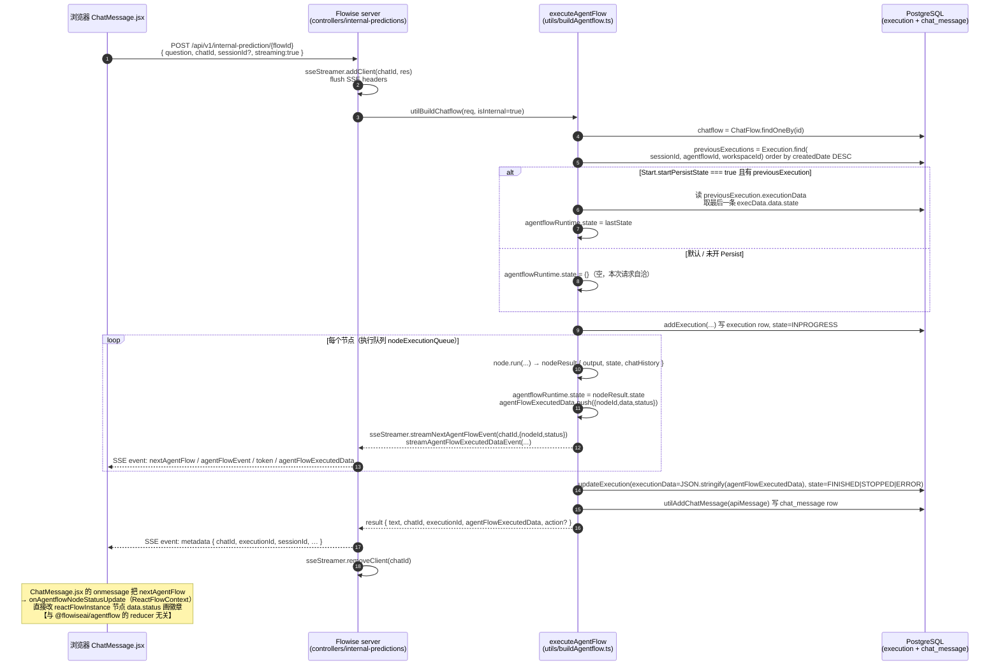
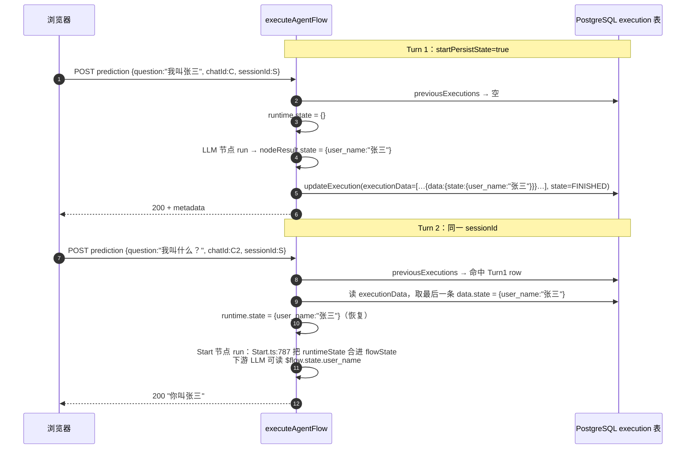
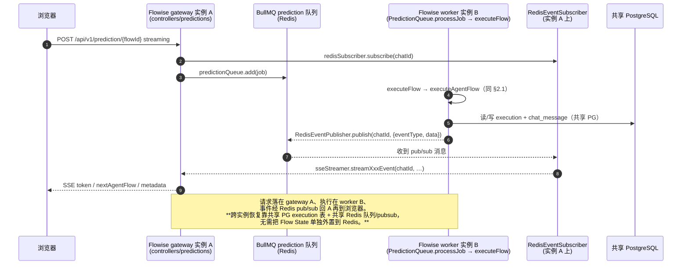

# Gate-2: Flow State 定位结论

> Issue: MZW-241 (M0.9) · 分支: `issue/MZW-241`（基于 `origin/issue/MZW-236`，含 `vendor/flowise/` Flowise 3.1.3 fork, commit `bb773ffa`）
> 勘察人: backend-dev · 日期: 2026-07-08
> 验收: product-manager + project-architect 双签（Gate-2 是 M3.3 Flow State 改造的入口）

## TL;DR（结论先放）

1. **"Flow State" 有两套，必须拆开看**，v0.2 把它们混为一谈：
   - **A. 编辑器 reducer（`@flowiseai/agentflow` 包内）**——`FlowExecutionState`/`agentflowReducer`，是 React `useReducer` 里的**纯展示态**，只给画布节点画状态徽章，**不在执行热路径上**。
   - **B. 服务端执行态（`packages/server` 内）**——`executeAgentFlow()` 里的 `agentflowRuntime.state`，这才是节点间共享的 `$flow.state.xxx`。它是**请求级**局部变量，跨轮次持久化**已经走 PostgreSQL `execution` 表**。
2. **"Flow State 默认进程内，需外置到 Redis"（v0.2 §5.5/§9.5）是伪命题**：服务端**没有**按 sessionId 缓存的进程级 Flow State 单例需要搬；跨轮次 state 已外置到 PG；多实例水平扩展 Flowise 自己用 `MODE=QUEUE`（BullMQ + Redis pub/sub + 共享 PG）已经解决。
3. **结论选 "需要但形态不同"**：平台要的"跨实例共享运行态"**已存在**（PG 存持久 state、Redis 做队列与 SSE pub/sub），**不需要**按 plan M3.3 原文去改 `agentflowReducer`/predictions controller 把 state 塞 Redis。M3.3 应重定义为"配置 + 集成验证 + 一个小默认值改动"，**不触发 D1 自研执行引擎**的失败路径。

---

## 1. Flow State 真实位置（定位到文件:行）

### 1.1 A 套：编辑器 reducer（展示态，非执行态）

| 项 | 位置 |
|---|---|
| 类型定义 | `vendor/flowise/packages/agentflow/src/core/types/execution.ts`（`FlowExecutionState { executionId, status, nodeStates }`、`NodeExecutionState`、`ExecutionStatus`） |
| Reducer | `vendor/flowise/packages/agentflow/src/infrastructure/store/agentflowReducer.ts`（`START_EXECUTION` / `SET_NODE_EXECUTION_STATUS` / `CLEAR_EXECUTION_STATE` 三个 action） |
| 容器 | `vendor/flowise/packages/agentflow/src/infrastructure/store/AgentflowContext.tsx`：`AgentflowStateProvider` 用 `useReducer(agentflowReducer, …)` 持有 `executionState` |
| 对外暴露 | `vendor/flowise/packages/agentflow/src/useAgentflow.ts`：`startExecution` / `setNodeExecutionStatus` / `clearExecutionState` |
| 包定位 | `vendor/flowise/packages/agentflow/package.json`：`"Embeddable React component for building and visualizing AI agent workflows"`，peerDeps = `react` / `reactflow` / `@mui/*`。**它是可嵌入画布组件，不是服务端执行引擎。** |

**关键反证（v0.2 论断偏差）**：Flowise 自己的生产 UI（`packages/ui`）**根本没 import `@flowiseai/agentflow`**——

```
$ grep -rln "@flowiseai/agentflow" vendor/flowise/packages/ui/src
（空）
```

生产画布 `vendor/flowise/packages/ui/src/views/agentflowsv2/Canvas.jsx` 不调 `useAgentflow`/`startExecution`/`agentflowReducer`；它用另一套 `flowContext`（`packages/ui/src/store/context/ReactFlowContext.jsx` 的 `onAgentflowNodeStatusUpdate`）直接把 `status` 写到 reactFlowInstance 节点的 `data.status` 上，**驱动来自服务端 SSE 事件**（见 §2）。`useAgentflow()` 在生产代码里只有 `packages/agentflow/src/Agentflow.tsx`（嵌入组件自身）消费。

> 即：`FlowExecutionState`/`agentflowReducer` 只在"把 `<Agentflow>` 嵌进自己应用、在画布上视觉跑流"这个场景里当展示态用。它**不是**一次 Prediction API 调用的执行状态载体。plan M0.9 Step 1-2 列的"`FlowExecutionState` 定义/reducer"被 v0.2 误当成"执行引擎的 state"，是 Gate-2 要纠正的核心偏差。

### 1.2 B 套：服务端执行态（真正的 Flow State）

| 项 | 位置 |
|---|---|
| 执行入口 | `vendor/flowise/packages/server/src/utils/buildAgentflow.ts`：`export const executeAgentFlow`（行 1541） |
| 运行态类型 | 同文件 行 97 `interface IAgentFlowRuntime { state?; chatHistory?; form?; webhook? }` |
| 运行态初始化 | 同文件 行 1655 `let agentflowRuntime: IAgentFlowRuntime = { state: {}, chatHistory: [], form: {}, webhook: {} }`——**函数内 `let`，请求级，非进程全局** |
| 节点间 state 写入 | 同文件 行 2128 `agentflowRuntime.state = nodeResult.state`（每个节点 `run()` 返回 `state`，合并进 runtime） |
| 跨轮次 state 恢复 | 同文件 行 1666 查 `previousExecutions`（按 `sessionId + agentflowId + workspaceId`）→ 行 1683 `if (startPersistState === true && previousExecution)` → 行 1690 从 `execData.data.state` 取上次 state → 行 1860 `agentflowRuntime.state = lastState` |
| 持久化写入 | `addExecution`（行 ~1890/1899，建 row）+ `updateExecution`（行 212/2231，写 `executionData = JSON.stringify(agentFlowExecutedData)` + `state`） |
| 持久化载体 | `vendor/flowise/packages/server/src/database/entities/Execution.ts`：`@Entity() Execution { id, executionData: text, state, agentflowId, sessionId, workspaceId, … }`——**PostgreSQL 表**（`DataSource.ts` 支持 `DATABASE_TYPE=postgres`） |
| 持久化开关 | `vendor/flowise/packages/components/nodes/agentflow/Start/Start.ts:758`：Start 节点输入参数 `startPersistState`（boolean, `optional`，**默认未开**）；`Start.ts:787` 把 `runtimeState` 合进 `flowState`，`Start.ts:877` 标 `outputData.persistState = true` |

**请求级、非进程全局的反证**——服务端按 sessionId 缓存 Flow State 的进程单例**不存在**：

| 进程级单例（`packages/server`） | 存的是 | 是 Flow State 吗 |
|---|---|---|
| `CachePool.ts` | `activeLLMCache` / `activeEmbeddingCache` / `activeMCPCache` / `ssoTokenCache`（LLM/Embedding 实例缓存） | ❌ |
| `AbortControllerPool.ts` | `abortControllers: Record<string, AbortController>`（按 `chatflowid_chatid`） | ❌（abort 信号） |
| `UsageCacheManager.ts` | 用量计数（QUEUE 模式下走 Redis） | ❌ |

没有任何一个持有 `$flow.state`。`agentflowRuntime` 是 `executeAgentFlow` 函数体内的局部变量，**请求结束即 GC**；下一轮请求从 PG `execution` 表重建。所以"把进程内的 Flow State 搬到 Redis"在 Flowise 3.1.3 里**找不到对象可搬**。

---

## 2. 一次 run 的状态流（时序图）

### 2.1 单轮 agentflow 执行（热路径，非 QUEUE 模式 / 单实例）



注意最后那条 Note：**生产 UI 的节点状态徽章由服务端 SSE 驱动 `ReactFlowContext`，不经过 `agentflowReducer`**。再次印证 A 套 reducer 不在热路径。

### 2.2 多轮 state 恢复（跨 turn 的"记忆"）



**跨轮次 Flow State 的载体是 PG `execution` 表，不是 Redis，也不是进程内存。**

### 2.3 多实例水平扩展（QUEUE 模式，跨实例）



关键文件：
- 队列入口：`vendor/flowise/packages/server/src/queue/PredictionQueue.ts`（`processJob` → `executeFlow`）
- Worker：`vendor/flowise/packages/server/src/commands/worker.ts`（`createWorker`，`QueueEvents` 监听 `abort`）
- 事件桥：`vendor/flowise/packages/server/src/queue/RedisEventPublisher.ts` + `RedisEventSubscriber.ts`（按 `chatId` 订阅，`handleEvent` 把 `nextAgentFlow`/`agentFlowEvent`/`agentFlowExecutedData` 等转给本机 `sseStreamer`）
- 控制器侧 subscribe：`controllers/predictions/index.ts:77`、`controllers/internal-predictions/index.ts:47`

---

## 3. 结论："Flow State 外置到 Redis" 是否仍需？

**☑ 需要但形态不同**（不是 plan 原文的"改 reducer/controller 把 state 塞 Redis"）。

### 3.1 为什么不是"是（按 plan 原文改）"

- `agentflowReducer.ts` 是**编辑器展示态**，改它不影响服务端执行；plan M3.3 写的"改 `agentflowReducer` / predictions controller 把 state 存 Redis"**目标对象错了**。
- `predictions/index.ts` 是 HTTP 入口，不持有 state；`executeAgentFlow` 里的 `agentflowRuntime` 是请求级局部变量，**没有进程级 singleton 可外置**。
- 跨轮次 state **已经在 PG `execution` 表**，重启不丢（只要 `startPersistState=true` 且共享 PG）。

### 3.2 为什么不是"否（完全不用 Redis）"

- 平台要水平扩展 / 跨实例恢复，**确实需要 Redis**——但用途是 BullMQ **任务队列** + SSE **事件 pub/sub**（`MODE=QUEUE`），以及限流/缓存。这部分 v0.2 已经规划（`packages/shared` 的 redis 客户端、`apps/scheduler` 消费 `dagents:tasks`）。
- 也确实需要"共享持久态"——但载体是**共享 PostgreSQL**（`execution` + `chat_message` + 平台 `runs` 表），不是把 Flow State 再塞一份 Redis。

### 3.3 真正的"形态不同"是什么

v0.2 说的"Flow State 默认进程内，重启即失，需外置 Redis" → 实际是：

| v0.2 假设 | Flowise 3.1.3 实际 | 对应措施 |
|---|---|---|
| Flow State 在进程内存 Map 里，重启即失 | 请求级局部变量 + PG `execution` 表持久化 | **无需搬 Redis**；部署用共享 PG 即可 |
| 需改 fork 把 state 存 Redis | state 已存 PG；多实例靠 QUEUE 模式 | **无需改 state 存储**；开启 QUEUE 模式即可 |
| `agentflowReducer` 是执行引擎 state | 它是编辑器展示态 reducer | **不要改它**；执行引擎在 `packages/server` |
| `@flowiseai/agentflow` 是 V2 执行引擎 | 它是 React 画布组件包 | D1 已锁定 fork 全量，不引此包当独立引擎（§0.5 已记） |

---

## 4. 若需改造，改造点在哪些文件

> 按 §3 结论，**M3.3 不应再做"Flow State → Redis"的 fork 改造**。下面只列"如果要让平台所有 agentflow 默认具备跨轮次 state 恢复"所需的最小改动（一个默认值 + 配置约束），以及明确**不要动**的文件。

### 4.1 唯一可能要动的小改（默认开启 Persist State）

| 文件:行 | 改动 | 理由 |
|---|---|---|
| `vendor/flowise/packages/components/nodes/agentflow/Start/Start.ts:758` | 把 `startPersistState` 的 `optional` 默认改为 `true`（或平台侧用 `overrideConfig` 强制） | 当前默认未开 → 跨轮次 state 不恢复；平台批量/长任务场景应默认开 |

> 这是**配置级**改动，不是架构改造。也可以**完全不改 fork**，改为在平台层（`apps/gateway` 或调度器）调 Prediction API 时统一带 `overrideConfig.startState` / 强制 `startPersistState`，代价是每个 flow 都要记得设。建议默认值改在 fork 里，最省心。

### 4.2 不要动的文件（plan 原文点名、但实际无关）

| 文件 | 为什么不动 |
|---|---|
| `vendor/flowise/packages/agentflow/src/infrastructure/store/agentflowReducer.ts` | 编辑器展示态 reducer，不在服务端执行路径；生产 UI 都没用它 |
| `vendor/flowise/packages/server/src/controllers/predictions/index.ts` | HTTP 入口，不持有 state；SSE/queue 路由已正确 |
| `vendor/flowise/packages/server/src/utils/buildAgentflow.ts` | 执行引擎本体，state 读写逻辑正确（请求级 runtime + PG 持久化），无需改 |

### 4.3 平台层该做的（不是 fork 改动，是部署/集成）

1. **部署必选**：`DATABASE_TYPE=postgres` + 共享 PG 连接（不能用每实例 sqlite）。
2. **部署必选**：`MODE=QUEUE` + `REDIS_URL`（开启 BullMQ 队列 + RedisEvent pub/sub，多实例才成立）。
3. **契约**：平台创建的 agentflow 默认 `startPersistState=true`（通过 §4.1 或 overrideConfig）。
4. **M3 集成验证**（M3.3 重定义后的实际产出）：起两个 Flowise 实例 + 共享 PG/Redis，验证 ① 同一 sessionId 跨实例续跑 ② 批量 fan-out 跨 worker ③ 重启后 `execution` 表恢复。这是**测试任务**，不是写 Redis state backend。

---

## 5. 对 plan / spec 的影响（给 project-architect & product-manager）

### 5.1 直接影响 M3.3

plan 原文（`docs/superpowers/plans/2026-07-08-mvp-implementation.md` M3.3）：

> "若 Gate-2 说需外置：改 `agentflowReducer` / predictions controller 把 state 存 Redis。若不需：实现 run checkpoint 入 Redis 的替代方案。"

Gate-2 结论：**两者都不取原意**。建议改写为：

> **M3.3（重定义）: Flow State 跨实例可恢复 — 配置 + 集成验证**
> - 不改 `agentflowReducer`/predictions controller（Gate-2 已证其非 state 载体）。
> - fork 小改：`Start.ts` `startPersistState` 默认 `true`（或平台 overrideConfig 强制）。
> - 部署约束：`DATABASE_TYPE=postgres` + `MODE=QUEUE` + 共享 Redis。
> - 集成测试：双实例 Flowise + 共享 PG/Redis，验证跨实例续跑 / fan-out / 重启恢复。
> - 平台层 run checkpoint（`runs` 表 + 断点续跑 M3.5）仍按原计划在 `apps/scheduler` 做，与 Flowise fork 解耦。

工作量：**远小于** v0.2 §6.4 "省掉 1500 行协作后端化改造"的乐观估计，也远小于 plan 原文 M3.3 的"改 state 存 Redis"。**不触发 §0.4 失败路径 (b) 自研执行引擎。**

### 5.2 v0.2 论断修正（补 §0.5 表）

| v0.2 论断 | Gate-2 勘察结论 |
|---|---|
| "Agentflow V2 是天生后端化的状态机引擎"（§3.2/§6.4/§9.5） | **半对**：服务端执行引擎（`packages/server/buildAgentflow.ts`）确实是后端状态机（节点依赖解析/执行队列/Flow State 共享/HITL 检查点全在 Node 端）。但 `@flowiseai/agentflow` **包**是 React 画布组件，不是引擎；别把二者混为一谈。 |
| "Flow State 默认进程内，需外置到 Redis"（§5.5/§9.5） | **伪命题**：请求级 runtime 非进程全局；跨轮次 state 已在 PG `execution` 表；多实例靠 QUEUE 模式 + 共享 PG + Redis 队列/pubsub。无需"把 state 搬 Redis"。 |
| "Flow State → Redis 是水平扩展前提"（§5.5） | **前提成立但手段不同**：水平扩展前提是"无进程内运行态"——这个 Flowise 已满足（runtime 请求级 + 持久态在 PG）。Redis 仍要，但用于队列/pubsub/缓存，不是 Flow State 存储。 |

### 5.3 不触发 D1 重评

spec §0.4 失败路径 (b)："自研执行引擎（回到 2c 路线，代价大）"——**不需要**。Flowise 3.1.3 的后端执行引擎 + PG 持久化 + QUEUE 多实例已经满足平台 MVP 的跨实例恢复诉求。Gate-2 通过。

---

## 6. Gate-2 判据自检

| 判据 | 状态 | 证据 |
|---|---|---|
| 时序图出炉 | ✅ | §2.1 单轮 / §2.2 多轮恢复 / §2.3 多实例 QUEUE |
| "Flow State 真实位置"定位到具体文件 | ✅ | §1.1（A 套编辑器 reducer）+ §1.2（B 套服务端 `executeAgentFlow` runtime + PG `Execution` 表） |
| "是否需 Redis 外置"有明确结论 | ✅ | §3 "需要但形态不同"：不需要按 plan 原文搬 Redis；Redis 用于队列/pubsub，持久 state 在 PG |
| 若需改造，指到具体文件 | ✅ | §4.1（仅 `Start.ts:758` 默认值）+ §4.2（明确不要动 reducer/controller）+ §4.3（部署配置） |

---

## 附：勘察覆盖的源文件清单（供复核）

- `vendor/flowise/packages/agentflow/src/core/types/execution.ts`
- `vendor/flowise/packages/agentflow/src/infrastructure/store/agentflowReducer.ts`
- `vendor/flowise/packages/agentflow/src/infrastructure/store/AgentflowContext.tsx`
- `vendor/flowise/packages/agentflow/src/useAgentflow.ts`
- `vendor/flowise/packages/agentflow/src/infrastructure/api/{client,chatflows,stores}.ts`
- `vendor/flowise/packages/agentflow/package.json`（peerDeps 证 React 组件包）
- `vendor/flowise/packages/server/src/controllers/predictions/index.ts`
- `vendor/flowise/packages/server/src/controllers/internal-predictions/index.ts`
- `vendor/flowise/packages/server/src/services/predictions/index.ts`
- `vendor/flowise/packages/server/src/utils/buildChatflow.ts`（`executeFlow`、`utilBuildChatflow`、AGENTFLOW 分支）
- `vendor/flowise/packages/server/src/utils/buildAgentflow.ts`（`executeAgentFlow`、`agentflowRuntime`、`addExecution`/`updateExecution`、`startPersistState` 恢复、HITL resume）
- `vendor/flowise/packages/server/src/DataSource.ts`（`DATABASE_TYPE=postgres` 支持）
- `vendor/flowise/packages/server/src/database/entities/{Execution,ChatMessage}.ts`
- `vendor/flowise/packages/server/src/CachePool.ts` / `AbortControllerPool.ts` / `UsageCacheManager.ts`（确认无 Flow State 单例）
- `vendor/flowise/packages/server/src/queue/{PredictionQueue,ScheduleQueue,QueueManager,RedisEventPublisher,RedisEventSubscriber}.ts`
- `vendor/flowise/packages/server/src/commands/worker.ts`
- `vendor/flowise/packages/server/src/index.ts`（`MODE=QUEUE` 装配）
- `vendor/flowise/packages/server/src/routes/{predictions,internal-predictions,executions}/index.ts`
- `vendor/flowise/packages/components/src/Interface.ts`（`INodeExecutionData`）、`vendor/flowise/packages/components/nodes/agentflow/Start/Start.ts`（`startPersistState`）
- `vendor/flowise/packages/ui/src/views/agentflowsv2/Canvas.jsx`、`vendor/flowise/packages/ui/src/views/chatmessage/{ChatMessage,ChatPopUp}.jsx`、`vendor/flowise/packages/ui/src/store/context/ReactFlowContext.jsx`（确认生产 UI 不用 `@flowiseai/agentflow`，徽章由 SSE 驱动）
- `vendor/flowise/packages/server/src` 全量 `grep flowState/FlowExecutionState/agentflowReducer` → **零命中**（与 issue 描述一致）
